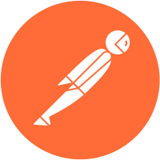

Here you can find my personal projects and reports. I'm looking for entry level position as QA Engineer / Manual Tester.

  - Currently working on:
     - **ISTQB Certificate**
     - **AirportCodeDecoder**
    
  - Contact me:
    - albertdrozdowski@gmail.com
    - [LinkedIn](https://www.linkedin.com/in/albertdr/)

# My tech stack

<a href="https://github.com" target="_blank" rel="noreferrer">
<picture>
  <source media="(prefers-color-scheme: dark)" srcset="img/github-mark-white.svg">
  <source media="(prefers-color-scheme: light)" srcset="img/github-mark.svg">
  
</picture>
</a>

 

<a href="https://git-scm.com/" target="_blank" rel="noreferrer">
<picture>
  <source media="(prefers-color-scheme: dark)" srcset="img/git-logo-white.svg">
  <source media="(prefers-color-scheme: light)" srcset="img/git-logo-orange.svg">
  
</picture>
</a>

# My IT hobby background and achievements
- In the past I was well known and contributed user of [TheModders.org](http://themodders.org) modding community forum (till ~2013):
  - It started my love to video games modding with Gothic game series and its engine ZenGin:
    - Daedalus language: [gothic-modding-community.github.io](https://gothic-modding-community.github.io/gmc/zengin/scripts/)
    - Spacer editor: [gothic-modding-community.github.io](https://gothic-modding-community.github.io/gmc/zengin/worlds/)
  - I'm an author of tutorials about tools inside of Sandbox 2 (editor for Crytek's CryEngine 2): [themodders.org](https://themodders.org/index.php?board=439.0)
  - Learned a lot about 3D low-poly modeling (Blender, 3Ds Max, Zbrush [for scuplting] ), game modding and real-time rendering

- I took part in Level Design contest organized by LevelDesign.pl blog and Techland with my project: [web.archive.org](https://web.archive.org/web/20131005091826/http://leveldesign.pl/rozstrzygniecie-konkursu-gotowy-na-koniec-swiata/)
  - I was using Sandbox 2 Editor for CryEngine 2: [Re-upload of official documentation](https://www.dj-copniker.de/sandbox2manual/index.html)

- After the mentioned contest, I became an author on LevelDesign.pl blog and was writing articles about Level Design, real time engines and interesting Environmets: [web.archive.org](https://web.archive.org/web/20131005043436/http://leveldesign.pl/author/eto/)
- In the meantime I was still heavily interested in Crytek's technology, moved to newest CryEngine: [cryengine.com](https://www.cryengine.com/)
- Now, sometimes in my free time, I'm using Unreal Engine just for fun: [unrealengine.com](https://www.unrealengine.com/)
